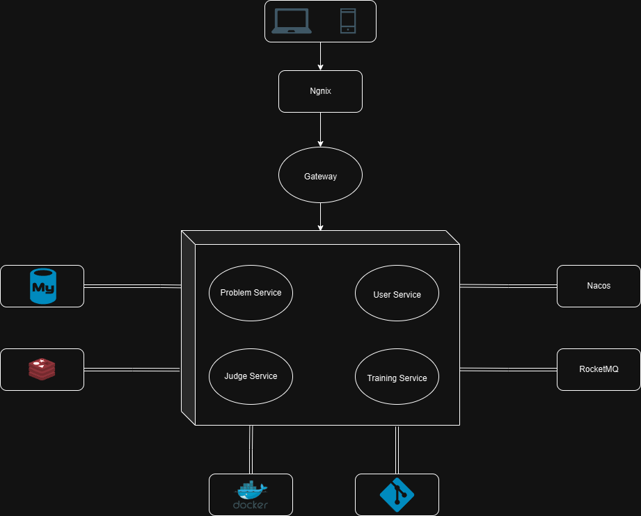

# PT Online Judge（PTOJ）

[简体中文](./README.md) | English

## Features

* Developed an online code evaluation system using Vue for the frontend and Spring Boot, Spring Cloud Alibaba for the backend.
* Implemented service registration and discovery with Nacos, and utilized Dubbo for RPC calls between microservices.
* Employed go-judge sandbox for code evaluation, using cgroup to isolate user programs, ensuring security.
* Integrated Sa-Token with Redis for distributed session management, gateway unified authentication, and RPC call authentication.
* Used Nacos as both the registry and configuration center, achieving automatic service registration and configuration management to enhance system scalability and reliability.
* Applied Sentinel for rate limiting on interfaces like the site-wide evaluation list, ensuring system stability.
* Integrated RocketMQ for handling code submission messages, enabling asynchronous code evaluation and peak shaving.
* Built a two-tier cache with Caffeine and Redis, reducing the response time for recent problem queries from 40ms to 20ms.
* Utilized Redis ZSet data structure for the user problem-solving leaderboard, increasing the leaderboard interface QPS from 90 to over 2000.
* Wrote Dockerfiles for microservices, creating Docker images and deploying the project on servers using Docker Compose for container orchestration.

## Deploy

This project can deploy by using docker-compose, Online Demo click [PTOJ](https://119.91.130.251/home).
**Currently the website is under review, so HTTPS is temporarily unavailable.**。

|                   Deploy Example                    |
|:---------------------------------------------------:|
|    [Development](ptoj-deploy/docker-compose.yml)    |
| [Production](ptoj-deploy/remote/docker-compose.yml) |

## Metrics

This project use Jmeter to test metrics, the results are as follows:

|             Method              | Mean Response Time | QPS  |
|:-------------------------------:|:------------------:|:----:|
| MySQL query without buffer pool |       1800ms       |  3   |
|  MySQL query with buffer pool   |       170ms        |  90  |
|           Redis query           |        80ms        | 2000 |

## Architecture
