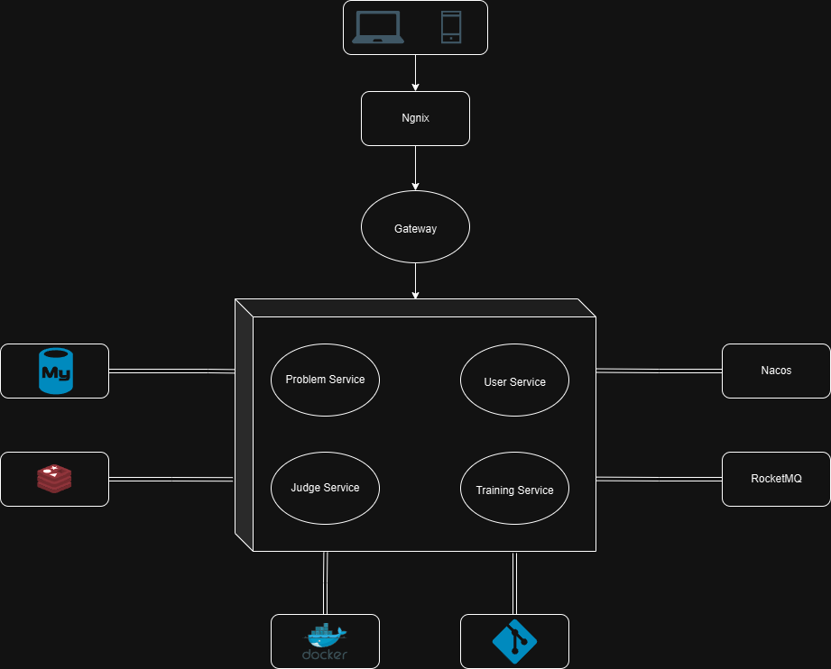

# PT Online Judge（PTOJ）

简体中文 | [English](./README-EN.md)

## 介绍

* 基于 Vue 和 SpringBoot 、Spring Cloud Alibaba 构建的前后端分离，微服务架构的在线代码评测系统。
* 使用 Nacos 实现服务注册与发现，Dubbo 实现微服务之间的 RPC 调用。
* 使用 go-judge 沙箱进行代码评测，判题使用 cgroup 隔离用户程序，保证安全性。
* 通过 Sa-Token 集成 Redis 实现了分布式 Session 会话、网关统一鉴权和 RPC 调用鉴权。
* 使用 Nacos 作为注册中心和配置中心，实现微服务的自动注册与配置管理，提高系统的可扩展性和可靠性。
* 使用 Sentinel 对查询全站评测列表等接口进行限流，保障系统的稳定性。
* 引入 RocketMQ 进行代码提交操作的消息队列处理，使代码评测异步进行，实现了流量的削峰。
* 使用 Caffeine + Redis 构建二级缓存，将查询最近题目的**响应时间从 40ms 优化至 20ms**。
* 使用 Redis 的 ZSet 数据结构实现用户过题排行榜功能，排行榜接口 **QPS 从 90 提升至 2000 以上**。
* 编写 Dockerfile 将各个微服务制作成 Docker 镜像，通过docker-compose容器编排将项目部署在服务器。

## 部署

本项目基于docker-compose进行部署，在线Demo见[PTOJ](https://119.91.130.251/home)（**目前公安备案审核中，暂时不能用域名**）。

|  用户名  |       密码       |
|:-----:|:--------------:|
| user1 | user1_password |

|                      部署参考                       |
|:-----------------------------------------------:|
|   [本地开发部署容器](ptoj-deploy/docker-compose.yml)    |
| [项目上线部署](ptoj-deploy/remote/docker-compose.yml) |

## 压测

本项目使用Jmeter进行压力测试，测试结果如下：

|    方案     | 平均响应时间 | 并发量  |
|:---------:|:------:|:----:|
| MySQL直接查询 | 1800ms |  3   |
| MySQL缓存查询 | 170ms  |  90  |
| Redis缓存结果 |  30ms  | 2000 |

其中各项环境参数如下：
* MySQL排行榜的表的数据量有约20k行。
* 服务器CPU配置为10核16线程，剩余可用内存16G。
* MySQL直接查询将innodb_buffer_pool_size = 0M（虽然默认最低设置为约512KB)。
* MySQL缓存查询将innodb_buffer_pool_size配置注释，走默认值。

## 架构

